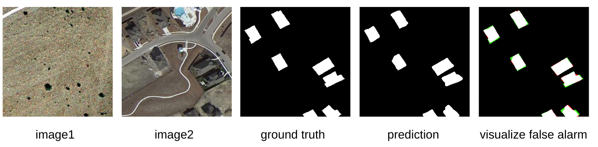
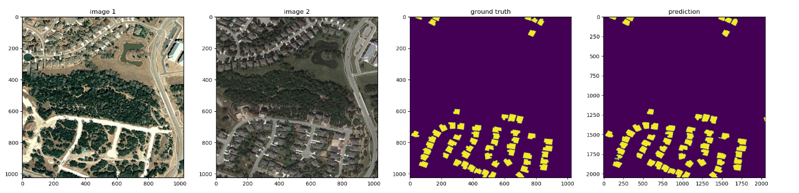

# SARAS-Net: Scale And Relation Aware Siamese Network for Change Detection
[](https://paperswithcode.com/sota/change-detection-for-remote-sensing-images-on?p=saras-net-scale-and-relation-aware-siamese)

[](https://paperswithcode.com/sota/change-detection-on-dsifn-cd?p=saras-net-scale-and-relation-aware-siamese)

[](https://paperswithcode.com/sota/building-change-detection-for-remote-sensing?p=saras-net-scale-and-relation-aware-siamese)

**Target:** Change detection aims to find the difference between two images at different times and output a change map.  

  `This paper has been accepted in AAAI-23.`

For more information, please see our paper at [AAAI](https://ojs.aaai.org/index.php/AAAI/article/view/26660) or [arxiv](https://arxiv.org/abs/2212.01287).

**Overview of SARAS-Net:** 


**Visualize each module by Gradcam:**   


## Requirements
```ruby
cuda: 11.0  
python: 3.6.9  
pytorch: 1.7.0  
torchvision: 0.8.1 
```
## Installation
```ruby
git clone https://github.com/f64051041/SARAS-Net.git  
cd SARAS-Net  
```

## Quick start
Download LEVIR-CD weight : https://drive.google.com/file/d/1Gs6iYQcZI1Jm4NhthCwWI2olbO-bpvTd/view?usp=share_link  
After downloaded the model weight, you can put it in `SARAS-Net/`.  
Then, run a demo to get started as follows:  
```ruby
python demo.py
```
After that, you can find the prediction results in `SARAS-Net/samples/`

<div align = center>
 
</div>


## Train
You can find `SARAS-Net/cfgs/config.py` to set the training parameter.
```ruby
python train.py
```
## Test  
After training, you can put weight in `SARAS-Net/`.  
Then, run a cal_acc.py to get started as follows: 
```ruby
python cal_acc.py
```
You can set `show_result = True` in `cal_acc.py` to show the result for each pairs.

<div align = center>
 
</div>

## Data structure
### Train Data Path
```ruby
train_dataset  
  |- train_dataset 
      |- image1, image2, gt  
  |- val_dataset  
      |- image1, image2, gt  
  |- train.txt
  |- val.txt
```
The format of `train.txt` and `val.txt` please refer to `SARAS-Net/train_dataset/train.txt` and `SARAS-Net/train_dataset/val.txt`   

### Test Data Path
```ruby
test_dataset  
  |- A 
      |- image1 
  |- B  
      |- image2 
  |- label
      |- gt 
```

### Data Download
LEVIR-CD: https://justchenhao.github.io/LEVIR/  

WHU-CD: https://study.rsgis.whu.edu.cn/pages/download/building_dataset.html  

DSIFN-CD: https://github.com/GeoZcx/A-deeply-supervised-image-fusion-network-for-change-detection-in-remote-sensing-images/tree/master/dataset

Quick train on LEVIR-CD : https://drive.google.com/file/d/1DAlxuqalNIPopt-WgtDmCYO98_jWM3ER/view?usp=share_link

Quick test on LEVIR-CD : https://drive.google.com/file/d/1Bj5GQ3hZcDVSpFGZKxm7zIuCBP5XEr6x/view?usp=share_link

## Result

| Dataset  | Pre. | Rec. | F1-score | IoU | OA | 
| ------------- | ------------- | ------------- | ------------- | ------------- | ------------- |
| LEVIR-CD  | 91.97% | 91.85%  | 91.91% | 84.95% | 99.10% |
| CCD-CD  | 97.76% | 97.23%  | 97.49% | 95.11% | 99.35% |
| WHU-CD  | 88.41% | 85.81%  | 87.09% | 77.14% | 98.89% |
| DSIFN-CD | 67.65% | 67.51%  | 67.58% | 51.04% | 89.01% |
   

